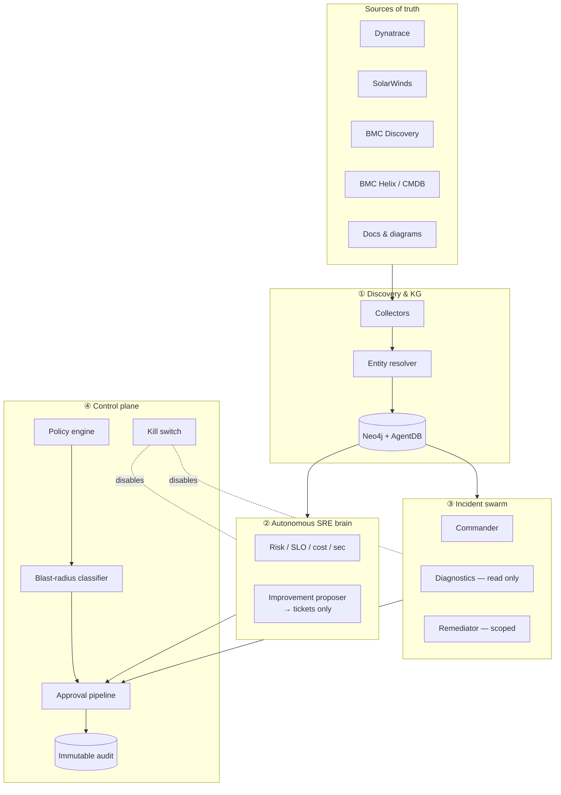

# SREFlow

> An enterprise SRE platform built on the ruflo agent-orchestration substrate.

SREFlow is a domain-specific overlay that lives inside this fork of [ruvnet/ruflo](https://github.com/ruvnet/ruflo). All SRE-specific customization lives under [`sre/`](sre/). The base ruflo tree is left untouched so upstream merges stay clean.

## Why it exists

Enterprise SRE teams drown in tool sprawl (Dynatrace, SolarWinds, BMC Helix/Discovery, Confluence, Jira, CMDB, cloud consoles). SREFlow coordinates a swarm of specialist agents that:

1. **Map business processes** end-to-end and keep a living knowledge graph + auto-generated diagrams.
2. **Watch reliability, risk, cost, and security** continuously, and propose improvements as tickets — never direct writes.
3. **Assist on critical incidents** with read-only diagnostics by default and tightly-scoped remediation behind a policy-enforced approval pipeline.

Agent autonomy is bounded by a **control plane** (policies, blast-radius classes, environment isolation, HITL gates, immutable audit). Without this control plane, agentic SRE is a foot-gun; with it, it's an amplifier.

## Architecture (high level)



## Layout

| Path | Purpose |
|---|---|
| [`sre/agents/`](sre/agents) | SRE agent definitions (collectors, graph, sre brain, incident swarm) |
| [`sre/policies/`](sre/policies) | Policy-as-code: blast-radius classes, approvals, freeze windows, tool allowlist |
| [`sre/schema/`](sre/schema) | Knowledge-graph schema (Neo4j) + canonical entity JSON Schema |
| [`sre/skills/`](sre/skills) | Claude Code skills the SRE agents invoke |
| [`sre/hooks/`](sre/hooks) | Pre/post-tool hooks that enforce policy and write the audit trail |
| [`sre/connectors/`](sre/connectors) | Connector config templates (Dynatrace, SolarWinds, BMC, docs). No secrets. |
| [`sre/commands/`](sre/commands) | Slash commands (`/sre-map`, `/sre-risk`, `/sre-incident`) |
| [`sre/CLAUDE.md`](sre/CLAUDE.md) | Behavioral rules that apply when agents operate on SRE tasks |

## Phased rollout

| Phase | Scope | Write authority |
|---|---|---|
| 0 | Stand up Layer 1 read-only — graph + auto-diagrams | none |
| 1 | Layer 2 proposers produce tickets | none |
| 2 | Layer 3 diagnostics-only on page | none |
| 3 | Tier-3 remediation within policy envelope | scoped, HITL per criticality |
| 4 | Broader autonomy only as precision metrics justify it | never destructive |

## Upstream tracking

The base ruflo is pinned via the `upstream` remote. Pull upstream into `main` periodically; the `sre/` overlay is additive and should never require merge conflict resolution with upstream code.

```bash
git fetch upstream
git checkout main && git merge upstream/main
```

Customization work happens on branches prefixed `sreflow/`.
